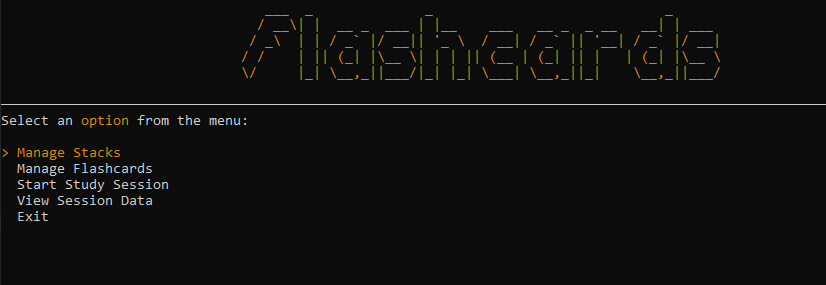
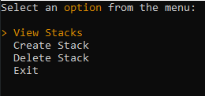
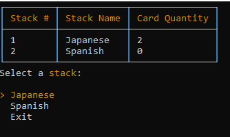
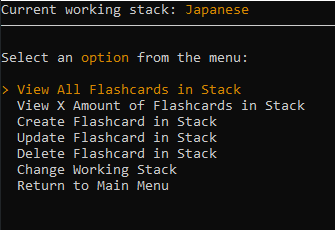
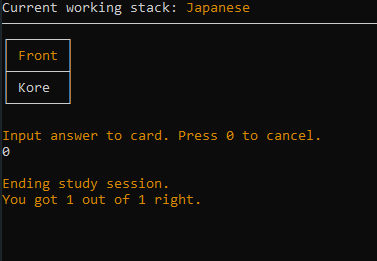

# Flashcards
- CRUD based console application for creating stacks of flashcards
- Developed using C#, SQLServer (uses localdb), Dapper and Spectre Console

# Features
- Managed with SQLServer
- Navigate app with key presses
- 
- Users can:
  - View stacks
  - Create stacks
  - Delete stacks 
  - 
- As well as choose a stack to:
  - View flashcards
  - Fetch specific amount of flashcards
  - Create flashcard
  - Delete flashcard
  - Update flashcard
  - 
  - 
- Has a study session area where users can:
  - Study a specific flash card stack
  - 
  - 
  - View all prior study sessions
  - 
- Lastly, features a report that shows:
  - Amount of sessions per month
  - Average score per stack per month
  - 

If a stack is deleted, all flashcards and study sessions associated with it will also be deleted.

# What I Learned
- Set up a localDb with SQL Server
- Started using parameterized queries with my SQL methods to protect againt injection attacks
- Linked tables using foreign keys
- Used ON DELETE CASCADE to automatically delete related rows
- Used ROW_NUMBER to get card and stack numbers that always started at 1
- Created DTOs in order to increase security of program when presenting information to user (hides the Stack Id)
- Used PIVOT tables to create an in depth report for sessions per year inputted
 
# Challenges
- First time using Sql Server Management Studio so goes without saying there was a learning curve with setting up the db, connecting to it and using C# with it.
- Didn't quite understand DTOs at first but eventually got it after extensive researching.
- PIVOT tables were without a doubt the most confusing thing to implement and honestly, I still don't understand it as much I would like. I've started FreeCodeCamp's course on this in order to try and get better.